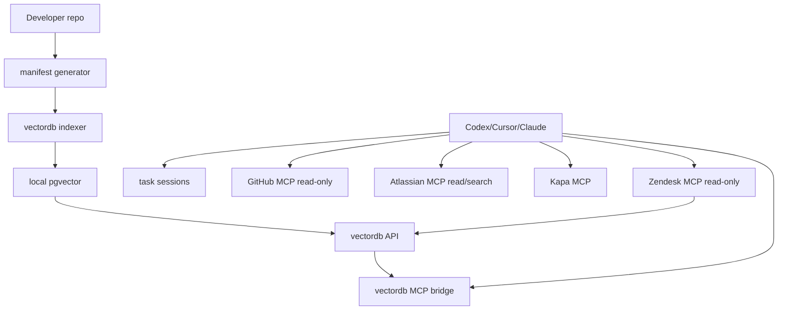

# local-tooling

Local developer AI stack for Codex, Cursor, and Claude.

It packages:

- local `pgvector` vectordb
- a FastAPI ingestion/search API
- an MCP bridge exposing `rag_health`, `rag_search`, and `rag_ingest`
- `rag_prepare_task` for a first-pass task context search
- read-only GitHub MCP wiring
- read/search Atlassian MCP wiring
- Kapa MCP wiring
- optional read-only Zendesk MCP wiring and ticket indexing
- local repo bootstrap indexing, generated on each developer machine
- lightweight task sessions for context, review, and reusable learning

## Quick start

Run these commands from the `local-tooling` repository. `CODE_REPO` must point
to the working code repository the developer wants the agent to understand and
work on. It is not the path to `local-tooling`.

Generic setup:

```bash
cd /path/to/local-tooling

cp .env.example .env
# Edit .env before continuing:
# - GITHUB_PERSONAL_ACCESS_TOKEN for GitHub MCP
# - ATLASSIAN_SITE_URL for Jira/Confluence
# - KAPA_* if Kapa is used
# - ZENDESK_ENABLED=true and ZENDESK_* only if the team uses Zendesk
# - EMBEDDING_BACKEND and related EMBEDDING_* / OLLAMA_* settings

CODE_REPO=/path/to/the/code-repo-you-work-on

./bin/local-tooling setup --agents all --repo "$CODE_REPO" --bootstrap
```

`gravitee-api-management` setup:

```bash
cd /path/to/local-tooling

cp .env.example .env
# Edit .env before continuing.

CODE_REPO=/path/to/gravitee-api-management

./bin/local-tooling setup --agents all --repo "$CODE_REPO" --profile gravitee-apim --bootstrap
```

Then restart Codex, Cursor, or Claude if they were already running.

Ask your agent:

```text
Configure yourself using the local-tooling repo and run doctor.
```

Optional, recommended for Cursor users:

```bash
CODE_REPO=/path/to/the/code-repo-you-work-on
./bin/local-tooling install-agent-rules --repo "$CODE_REPO" --agents cursor
```

This writes workflow rules into the target code repo, for example
`.cursor/rules/local-tooling.mdc`.

## Dockerized Ollama (optional)

The default `EMBEDDING_BACKEND=mock` is only meant for first-time plumbing
tests: its embeddings carry no semantic meaning, so vector search quality is
poor. For real semantic search, switch to Ollama.

If you prefer keeping everything in Docker instead of installing Ollama on the
host, enable the optional `ollama` service:

```bash
# In .env
EMBEDDING_BACKEND=ollama
OLLAMA_URL=http://ollama:11434
COMPOSE_PROFILES=ollama
```

```bash
./bin/local-tooling start
docker exec local-tooling-ollama ollama pull nomic-embed-text
```

Then re-index so existing chunks get real embeddings:

```bash
CODE_REPO=/path/to/the/code-repo-you-work-on
./bin/local-tooling setup --agents all --repo "$CODE_REPO" --bootstrap
```

Notes:

- `nomic-embed-text` produces 768-dim vectors, matching the default
  `EMBEDDING_DIM=768`, so no schema change is needed.
- Inside Docker, Ollama runs CPU-only on macOS/Windows. A host install
  (`OLLAMA_URL=http://host.docker.internal:11434`) uses the GPU and is faster
  for bulk indexing; both options are otherwise equivalent.

## Upgrade

Existing users can update with the same flow as the initial setup. This keeps
the local vectordb volume and rebuilds only the service images/configuration.

Generic upgrade:

```bash
cd /path/to/local-tooling
git pull

CODE_REPO=/path/to/the/code-repo-you-work-on

./bin/local-tooling stop
./bin/local-tooling setup --agents all --repo "$CODE_REPO" --bootstrap
```

`gravitee-api-management` upgrade:

```bash
cd /path/to/local-tooling
git pull

CODE_REPO=/path/to/gravitee-api-management

./bin/local-tooling stop
./bin/local-tooling setup --agents all --repo "$CODE_REPO" --profile gravitee-apim --bootstrap
```

If the target repo should receive/update the optional Cursor workflow rules, run:

```bash
CODE_REPO=/path/to/the/code-repo-you-work-on
./bin/local-tooling install-agent-rules --repo "$CODE_REPO" --agents cursor
```

Restart Codex, Cursor, or Claude after upgrading so they reload MCP config and
new tools such as `rag_prepare_task`.

Do not run `docker compose down -v` unless you intentionally want to delete the
local vectordb data.

## Common commands

```bash
CODE_REPO=/path/to/the/code-repo-you-work-on

./bin/local-tooling start
./bin/local-tooling stop
./bin/local-tooling doctor
./bin/local-tooling manifest --repo "$CODE_REPO" --profile default
./bin/local-tooling index --repo "$CODE_REPO" --profile default
./bin/local-tooling context --repo "$CODE_REPO" --task "APIM-12345 ..."
./bin/local-tooling review-change --repo "$CODE_REPO"
./bin/local-tooling learn --repo "$CODE_REPO" --task "APIM-12345 ..." --summary-file learning.md
./bin/local-tooling install-agent-rules --repo "$CODE_REPO" --agents cursor
./bin/local-tooling print-config --agent codex
```

## Bootstrap indexing

Bootstrap indexing does not transfer a database. It generates a local manifest from files the developer already has access to, then ingests those files into their local vectordb.

The `--repo` value controls what gets indexed. For example, if a developer works
on `gravitee-api-management`, `--repo` should be the absolute path to their local
checkout of `gravitee-api-management`.

The default profile indexes high-signal repo context:

- `AGENTS.md` files
- `.agent-rules/**`
- README and contributor docs
- build/package manifests
- selected docs
- selected source and test files

The `gravitee-apim` profile adds APIM-specific module rules and higher-signal Java/Angular patterns.

Generated manifests are written to `manifests/generated/`. Reports are written to `reports/`.

## Zendesk

Zendesk is disabled by default. Enable it only for teams that need Support
ticket context:

```bash
ZENDESK_ENABLED=true
ZENDESK_BASE_URL=https://your-subdomain.zendesk.com
ZENDESK_AUTH_MODE=oauth
ZENDESK_OAUTH_ACCESS_TOKEN=...
ZENDESK_INDEX_DEFAULT_QUERY='type:ticket updated>2026-01-01'
```

When enabled, `setup` adds the read-only Zendesk MCP adapter to agent configs,
`doctor` validates Zendesk auth, and `setup --bootstrap` indexes tickets
matching `ZENDESK_INDEX_DEFAULT_QUERY`.

Zendesk commands:

```bash
./bin/local-tooling zendesk-search --query "type:ticket tag:apim"
./bin/local-tooling zendesk-index --query "type:ticket tag:apim updated>2026-01-01"
./bin/local-tooling zendesk-index --ticket-id 12345
```

Indexed tickets are stored in vectordb with sources such as
`zendesk/your-subdomain` and paths such as `tickets/12345`.

## Task workflow

The workflow is intentionally advisory by default. It improves context gathering
without blocking simple local development.

Start a non-trivial task with:

```bash
CODE_REPO=/path/to/the/code-repo-you-work-on
./bin/local-tooling context --repo "$CODE_REPO" --task "APIM-12345 short task summary"
```

This queries vectordb, writes a context receipt under:

```text
<repo>/.local-tooling/sessions/<session-id>/context.json
```

When the target repo is a Git repository, `.local-tooling/` is added to its
local `.git/info/exclude` so session receipts do not pollute commits.

Before a final answer or commit, run:

```bash
CODE_REPO=/path/to/the/code-repo-you-work-on
./bin/local-tooling review-change --repo "$CODE_REPO"
```

By default this is warning-only. Use `--strict` only when you want it to fail on
missing context, missing test changes for production edits, or missing learning.

When the task produced reusable knowledge, save it:

```bash
CODE_REPO=/path/to/the/code-repo-you-work-on
./bin/local-tooling learn --repo "$CODE_REPO" --task "APIM-12345" --summary-file learning.md
```

If there is nothing useful to remember, record that explicitly without ingesting:

```bash
CODE_REPO=/path/to/the/code-repo-you-work-on
./bin/local-tooling learn --repo "$CODE_REPO" --task "APIM-12345" --skip "mechanical rename, no reusable learning"
```

To make this workflow visible to agents in the target repo:

```bash
CODE_REPO=/path/to/the/code-repo-you-work-on
./bin/local-tooling install-agent-rules --repo "$CODE_REPO" --agents cursor
```

## Safety defaults

GitHub and Atlassian are configured as read-only by default. Mutating tools such as creating PRs, editing Jira issues, adding comments, or merging PRs are disabled in generated agent config. Zendesk only exposes read-only tools and local vectordb ingestion.

If you need write-capable tools, add them explicitly after reviewing `docs/security.md`.

## Requirements

- Docker with Compose v2
- Python 3.10+
- Node/npm for `npx mcp-remote`
- Network access for GitHub/Atlassian/Kapa remote tools

## Architecture


