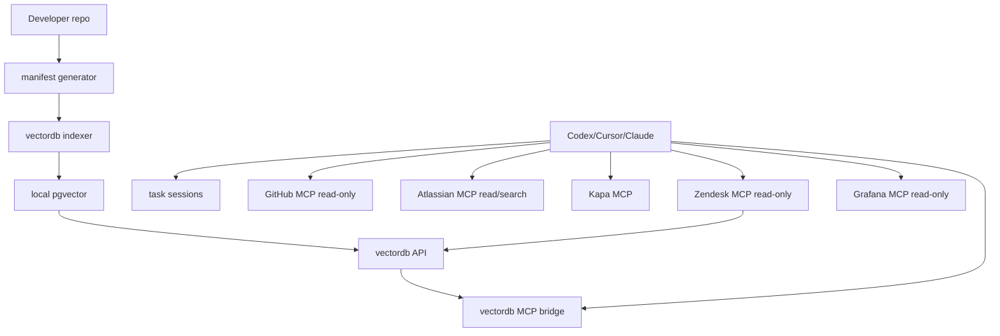

# local-tooling

Local developer AI stack for Codex, Cursor, and Claude.

It does not replace the AI coding assistant or introduce a separate daily
workflow. Developers continue working in Codex, Cursor, or Claude as before.
The stack gives those agents better repository-specific and
organisation-specific context through MCP tools, improving the quality of
their investigation and implementation.

The CLI is primarily for setup, indexing, upgrades, and diagnostics. During
everyday work, agents use the configured MCP tools, especially
`rag_prepare_task`, to gather relevant context before investigating or changing
code.

It packages:

- local `pgvector` vectordb
- a FastAPI ingestion/search API
- an MCP bridge exposing `rag_health`, `rag_search`, and `rag_ingest`
- `rag_prepare_task` for a first-pass task context search
- read-only GitHub MCP wiring
- read/search Atlassian MCP wiring
- Kapa MCP wiring
- optional read-only Zendesk MCP wiring and ticket indexing
- optional read-only Grafana MCP wiring for datasource queries and log links
- local repo bootstrap indexing, generated on each developer machine
- lightweight task sessions for context, review, and reusable learning

## Quick start

Run these commands from the `local-tooling` repository. `CODE_REPO` must point
to the working code repository the developer wants the agent to understand and
work on. It is not the path to `local-tooling`.

Setup:

```bash
cd /path/to/local-tooling

cp .env.example .env
# Edit .env before continuing:
# - GITHUB_PERSONAL_ACCESS_TOKEN for GitHub MCP
# - ATLASSIAN_SITE_URL for Jira/Confluence
# - KAPA_* if Kapa is used
# - ZENDESK_ENABLED=true and ZENDESK_* only if the team uses Zendesk
# - EMBEDDING_BACKEND and related EMBEDDING_* / OLLAMA_* settings

CODE_REPO=/path/to/the/code-repo-you-work-on

./bin/local-tooling setup --agents all --repo "$CODE_REPO" --bootstrap
```

Then restart Codex, Cursor, or Claude if they were already running.

Ask your agent:

```text
Configure yourself using the local-tooling repo and run doctor.
```

## Daily use

After setup, use Codex, Cursor, or Claude normally.

For a non-trivial task, describe the work to your agent as usual. The agent
must first gather relevant context with `rag_prepare_task`, then verify useful
results in the current repository before relying on them.

You do not need to manually run `local-tooling context` for every task. It
remains available when you want to inspect or record a context search yourself;
it does not replace the agent's MCP workflow.

Optional, recommended for Cursor users:

```bash
CODE_REPO=/path/to/the/code-repo-you-work-on
./bin/local-tooling install-agent-rules --repo "$CODE_REPO" --agents cursor
```

This writes workflow rules into the target code repo, for example
`.cursor/rules/local-tooling.mdc`.

## Upgrade

Existing users can update with the same flow as the initial setup. The commands
below keep the local vectordb volume, rebuild the service images, update agent
configuration, regenerate the manifest, and re-index the target repository.
When Zendesk is enabled, `--bootstrap` also re-indexes tickets matching
`ZENDESK_INDEX_DEFAULT_QUERY`. After `git pull`, compare `.env.example` with
your existing `.env` and add any settings you need; setup does not rewrite
`.env`.

Upgrade:

```bash
cd /path/to/local-tooling
git pull

CODE_REPO=/path/to/the/code-repo-you-work-on

./bin/local-tooling stop
./bin/local-tooling setup --agents all --repo "$CODE_REPO" --bootstrap
```

If the target repo should receive/update the optional Cursor workflow rules, run:

```bash
CODE_REPO=/path/to/the/code-repo-you-work-on
./bin/local-tooling install-agent-rules --repo "$CODE_REPO" --agents cursor
```

Restart Codex, Cursor, or Claude after upgrading so they reload MCP config and
new tools such as `rag_prepare_task`.

Do not run `docker compose down -v` unless you intentionally want to delete the
local vectordb data.

## CLI commands

Use the CLI for setup and maintenance:

```bash
CODE_REPO=/path/to/the/code-repo-you-work-on

./bin/local-tooling start
./bin/local-tooling stop
./bin/local-tooling doctor
./bin/local-tooling manifest --repo "$CODE_REPO"
./bin/local-tooling index --repo "$CODE_REPO"
./bin/local-tooling install-agent-rules --repo "$CODE_REPO" --agents cursor
./bin/local-tooling print-config --agent codex
```

Optional task-session commands:

```bash
CODE_REPO=/path/to/the/code-repo-you-work-on

./bin/local-tooling context --repo "$CODE_REPO" --task "TASK-123 ..."
./bin/local-tooling review-change --repo "$CODE_REPO"
./bin/local-tooling learn --repo "$CODE_REPO" --task "TASK-123 ..." --summary-file learning.md
```

## Bootstrap indexing

Bootstrap indexing does not transfer a database. It generates a local manifest from files the developer already has access to, then ingests those files into their local vectordb.

The `--repo` value controls what gets indexed. Pass the absolute path to the
local checkout of the repository you want the agent to work on.

The default profile indexes high-signal repo context:

- `AGENTS.md` files
- `.agent-rules/**`
- README and contributor docs
- build/package manifests
- selected docs
- selected Java and TypeScript source and test files

The CLI selects an indexing profile for the target repository automatically.
Use `--profile` to override that choice.

`EMBEDDING_BACKEND=mock` is the default. It computes deterministic embeddings
locally, which is useful for checking the pipeline but gives limited semantic
search quality. `ollama` sends text chunks to the configured `OLLAMA_URL`
(normally Ollama on the developer's machine). `openai-compatible` sends indexed
text chunks and search queries to the configured `EMBEDDING_BASE_URL`
`/embeddings` endpoint; use it only for content approved for that destination.
After changing the backend, rerun `setup --bootstrap` to apply the setting and
re-index the target repository. Re-index any other ingested sources separately.

Generated manifests are written to `manifests/generated/`. Reports are written to `reports/`.

## Zendesk

Zendesk is disabled by default. Enable it only for teams that need Support
ticket context:

```bash
ZENDESK_ENABLED=true
ZENDESK_BASE_URL=https://your-subdomain.zendesk.com
ZENDESK_AUTH_MODE=oauth
ZENDESK_OAUTH_ACCESS_TOKEN=...
ZENDESK_INDEX_DEFAULT_QUERY='type:ticket updated>2026-01-01'
```

When enabled, `setup` adds the read-only Zendesk MCP adapter to agent configs,
`doctor` validates Zendesk auth, and `setup --bootstrap` indexes tickets
matching `ZENDESK_INDEX_DEFAULT_QUERY`.

Zendesk commands:

```bash
./bin/local-tooling zendesk-search --query "type:ticket tag:example"
./bin/local-tooling zendesk-index --query "type:ticket tag:example updated>2026-01-01"
./bin/local-tooling zendesk-index --ticket-id 12345
```

Replace `example` with a tag used by your team.

Indexed tickets are stored in vectordb with sources such as
`zendesk/your-subdomain` and paths such as `tickets/12345`.

## Grafana

The read-only Grafana MCP adapter is disabled by default. To enable it, set
`GRAFANA_ENABLED=true`, `GRAFANA_BASE_URL`, and a read-only service account
`GRAFANA_TOKEN` in `.env`. Rerun `setup` with your usual `--agents` and `--repo`
values to add the adapter to agent configuration, then restart the agent.
It exposes datasource queries and links to matching logs. See the
[Grafana adapter guide](services/grafana-mcp-adapter/README.md) for the tools,
optional Loki datasource UID, and token setup.

## Context-aware task workflow

The normal entry point is your AI coding assistant: Codex, Cursor, or Claude.
For every non-trivial task, the agent must use the `rag_prepare_task` MCP tool
before analysis or edits (hybrid retrieval, with a limit of at least 8 for broad
work). If the initial context is incomplete, use `rag_search` to refine it.
RAG results provide orientation only; verify relevant hits against current
repository files and applicable repository instructions before acting.

Before accessing a target service through a browser or web search, check the
available MCP tools and use a suitable one first. Use the browser when the MCP
tool is unavailable, lacks the needed operation, or fails.

For reusable non-sensitive knowledge, call `rag_ingest` and verify it with
`rag_search`. Never ingest secrets, credentials, or personal data.

### Optional manual CLI workflow

Use this when you want to inspect the retrieved context or deliberately create
a local session receipt. It is not required for normal agent-driven work and
does not replace `rag_prepare_task` for the agent.

```bash
CODE_REPO=/path/to/the/code-repo-you-work-on
./bin/local-tooling context --repo "$CODE_REPO" --task "TASK-123 short task summary"
```

This queries vectordb and writes a context receipt under:

```text
<repo>/.local-tooling/sessions/<session-id>/context.json
```

When the target repo is a Git repository, `.local-tooling/` is added to its
local `.git/info/exclude` so session receipts do not pollute commits.

Before a final answer or commit, you can also run:

```bash
CODE_REPO=/path/to/the/code-repo-you-work-on
./bin/local-tooling review-change --repo "$CODE_REPO"
```

By default this is warning-only. Use `--strict` only when you want it to fail on
missing context, missing test changes for production edits, or missing learning.
It checks local session receipts, so it may warn about missing context or
learning receipts even when the agent used MCP directly.

When the task produced reusable knowledge, you can save it:

```bash
CODE_REPO=/path/to/the/code-repo-you-work-on
./bin/local-tooling learn --repo "$CODE_REPO" --task "TASK-123" --summary-file learning.md
```

If there is nothing useful to remember, record that explicitly without ingesting:

```bash
CODE_REPO=/path/to/the/code-repo-you-work-on
./bin/local-tooling learn --repo "$CODE_REPO" --task "TASK-123" --skip "mechanical rename, no reusable learning"
```

To make this context-aware workflow visible to agents in the target repo:

```bash
CODE_REPO=/path/to/the/code-repo-you-work-on
./bin/local-tooling install-agent-rules --repo "$CODE_REPO" --agents cursor
```

## Safety defaults

GitHub and Atlassian are configured as read-only by default. Mutating tools such
as creating PRs, editing Jira issues, adding comments, or merging PRs are
disabled in generated agent config. Zendesk only exposes read-only tools and
local vectordb ingestion. Grafana is disabled by default and its adapter exposes
read-only tools when enabled.

If you need write-capable tools, add them explicitly after reviewing `docs/security.md`.

## Requirements

- Docker with Compose v2
- Python 3.10+
- Node/npm for `npx mcp-remote`
- Network access for GitHub/Atlassian/Kapa remote tools

## Architecture


